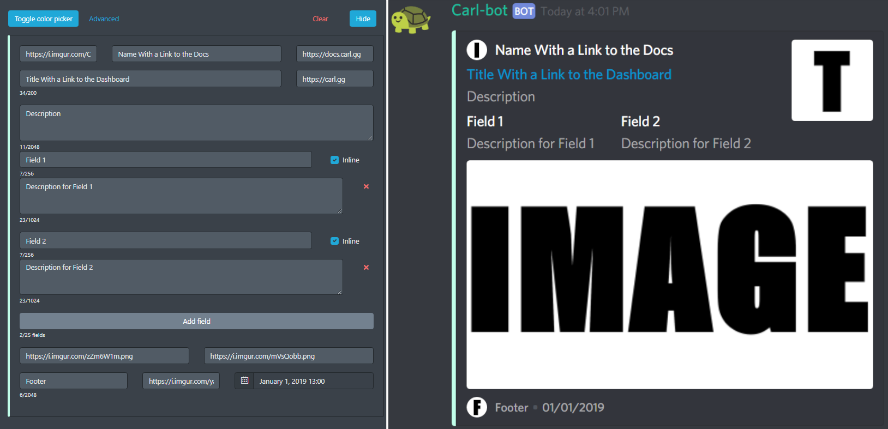

# Embeds

!!! info
    `cembed` and `ecembed` take raw JSON as their arguments. If you're new to embeds, using [Carl-bot's Dashboard](https://carl.gg/) can be helpful as the embed section lets you fill in an embed template and shows you how it will end up looking instantly.

### Embed Commands

???+ tldr "Embed Commands"
	| Name | Example | Usage |
	| :--- | :--- | :--- |
	| embed [channel] &lt;color&gt; &lt;title \| description&gt; | !embed #get-roles eeaaee I'm a title \| and I'm the description | Creates a simple embed with the colored strip, a title and a description. |
	| **editembed &lt;msg\_ID&gt; &lt;title \| description&gt;** | !editembed 32538901189123 I'm a new title \| and I'm an updated description | Edits a message in the same format you create basic embeds |
	| **rr color [channel] &lt;msg\_ID&gt; &lt;color&gt;** | !rr color 182923492394927 eeeaaa | Edits the color strip on the left side of the embed. If the embed is not a reaction role embed, you need to either use the command in the same channel as the embed or specify it as the first argument. |
	| cembed  [channel] &lt;JSON&gt; | !cembed #secret {"title": "hello world"} | Also accepts a pastebin link since it can be bigger than 2000 characters. |
	| **ecembed &lt;msg\_ID&gt; &lt;channel&gt; &lt;JSON/Pastebin\_Link/Starb.in\_Link&gt;** | !ecembed 31203123191 #secret {"title": "Woah, a new title!"} | Edits ANY embed the bot has posted using the JSON or JSON source that follows the msg ID and channel. |
	| embedsource &lt;msg\_ID&gt; [channel] | !embedsource 9312838121123 #bilderberg | Gets the raw JSON from an embed |

### Embed Builder Guide

???+ info "Embed Builder Guide"
	
	<table><tr><td>`I` = Icon URL</td><td>`T` = Thumbnail URL</td><td>`Image` = Image URL</td><td>`F` = Footer Icon</td></tr></table>
	*Image URLs must be direct image links. This means the URL should contain the image's file extension, like `.jpg`, `.jpeg`, `.png`, or `.gif`.*

### Embed Rules and Limits

???+ info "Embed Rules and Limits"
	* URL fields must be an HTTP/HTTPS formatted URL (begins with http:// or https://).
	* All Title fields, the (Author's) Name field, and the Footer cannot properly display Discord mentions or named links, and have limited support of markdown formatting.
	* If an additional field exists, neither the title nor the description can be empty.
	* "Name" must have a value for "Name URL" to work.
	* "Title" must have a value for "Title URL" to work.
	* "Name" must have a value for "Icon URL" to display.
	* "Footer" must have a value for the "Footer icon" to display.
	* In addition to the stated character limits for each field provided below the embed builder's text boxes, the sum of all characters in an embed must not exceed 6000 characters.
	* Do not put values in the JSON "timestamp": field if you don't know the correct format for them. The correct format is ISO 8601: `yyyy-mm-ddTHH:MM:SS.000Z`

### Editing an Embed

???+ example "Editing an Embed"
	Editing complex embeds can be daunting to users unfamiliar with JSON. Follow these steps:
	
	1. Use the `embedsource` command to obtain your embed's content and layout. Copy the JSON Carl-bot outputs.
	2. Paste the JSON into the embed builder on [the dashboard](https://carl.gg/) (on the top-right where it says "Raw JSON") then click "Apply".
	3. Make your edits in the embed builder.
	4. Click the "Copy to clipboard" button on the right side of the builder to copy the JSON for your edited embed.
	5. If the JSON is longer than what Discord allows you to put into the text box, paste the raw JSON into a site like [Pastebin](https://pastebin.com/) or [Starb.in](https://starb.in/).
	6. Use the `ecembed` command to update your embed by using the JSON, or Pastebin/Starb.in link.